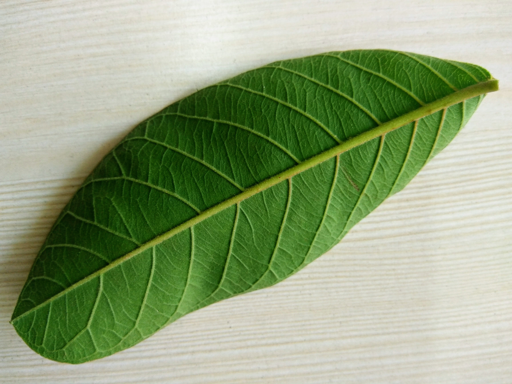

# BOL: Book Of Leaves

1. [Leaf 001: Guava Leaf](#leaf-001)
2. coming soon

## Leaf 001

  
 

The leaves of guava tree are full of antioxidants, anti-imflammatory agents, antibacterials and even tannins that have significant health benefits, from treating stomach troubles to chronic diseases like cancer.
The leaves can be brewed to make tea, which releases vitamin C and flavonoids like quercetin. Studies show qualitites of this superfruit's leaves, as they help in:

* Diarrhea
* Obesity
* Diabetes
* High Cholestrol
* Gastric Cancer 
* etc.

[ref](https://www.medicaldaily.com/6-health-benefits-guava-leaves-treating-diarrhea-cancer-353666)

